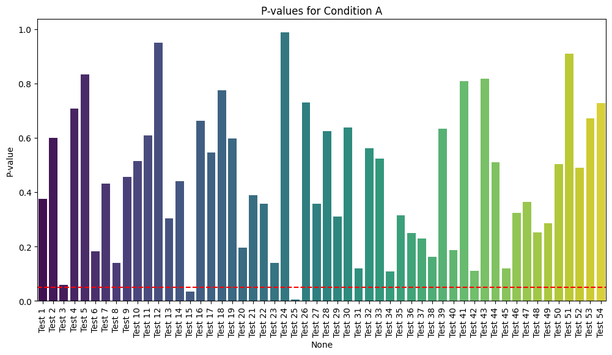

# Visualizing P-Values (Sample Plot Options)

The objective of this repo is to showcase possible dataviz options for the project at:

https://www.upwork.com/jobs/~014f0f75436a53e85e

Some samples:

## Bar Plot



## Box Plot


## Clustered Heatmap


## Swarm Plot


## Violin Plot


## Getting Started

### Dependencies

* **Python Version**: 3.8.8 (or compatible)

* **Python Libraries**:
  * `matplotlib==3.4.2`
  * `seaborn==0.11.1`
  * `pandas==1.2.4`
  * `numpy==1.20.2`
  * `jupyterlab==4.2.4`

### Installing

1. **Clone the Repository**:
   ```bash
   git clone https://github.com/thegrif/upwork-data-viz
   cd p-value-visualizations
   ```

2. **Create a virtual environment**:
   ```bash
   pyenv virtualenv 3.8.8 p-value-visualizations-env
   ```

3. **Activate the virtual environment**:
   ```bash
   pyenv activate p-value-visualizations-env
   ```

4. **Install the required Python libraries**:
   ```bash
   pip install -r requirements.txt
   ```

### Executing program

1. **Start Jupyter Notebook**:
   ```bash
   jupyter notebook
   ```

2. **Open the Notebook**:
   Navigate to the `p_value_visualizations.ipynb` file in the Jupyter interface and open it.

3. **Run the Notebook**:
   Execute the cells to generate the various p-value visualizations.

## Authors

Contributors names and contact info

Tom Griffin https://www.upwork.com/freelancers/tomgriffin